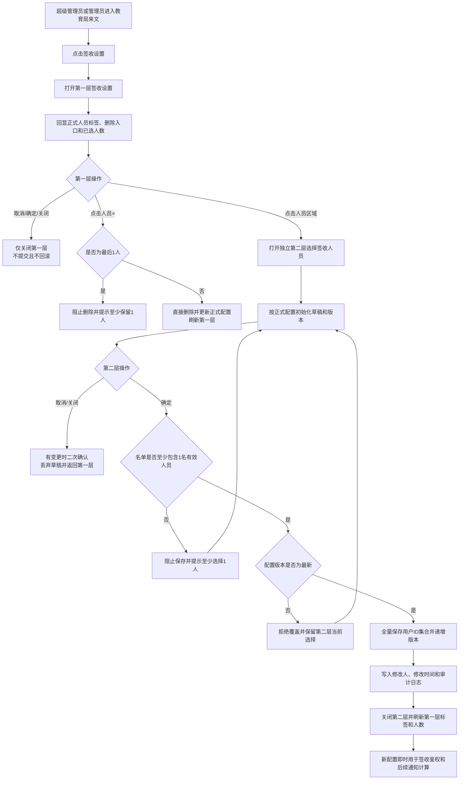
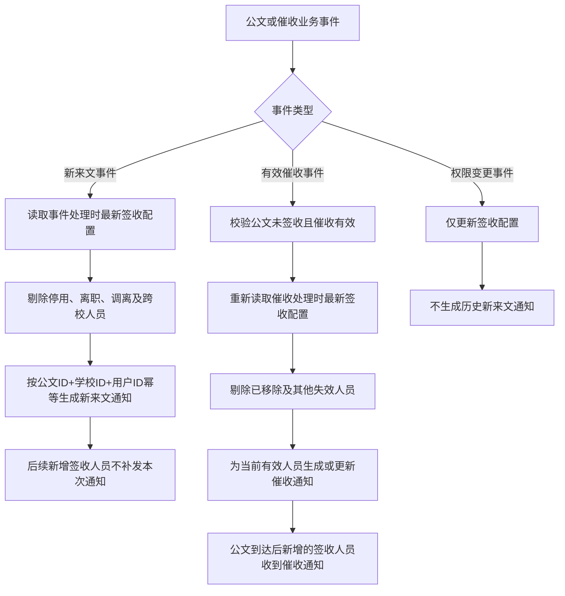

# 学校端教育局来文签收设置 PRD

版本：PRD-V1
日期：2026-08-21
适用端：学校端 PC、学校端移动端消息通知

# 1. 背景与目标

学校端“公文管理—教育局来文”当前缺少学校级签收人员配置能力，教育局来文的签收操作与消息接收人无法由学校管理员统一维护。人员职责调整后，系统无法明确控制谁可以签收历史及新到来文，也无法保证新来文通知、教育局催收通知与当前签收权限一致。

本需求在学校端 PC“教育局来文”页面新增“签收设置”按钮。用户点击后可查看并修改本校教育局来文的签收人员。系统以签收设置结果作为签收操作和移动端消息通知的统一权限依据：

- 仅当前签收人员可对本校教育局来文执行签收。
- 新教育局来文到达时，系统向当时有效的签收人员发送移动端新来文通知。
- 用户新增为签收人员后，可签收权限生效前已接收且尚可办理的历史来文，但系统不补发这些来文到达时的历史通知。
- 教育局对未签收公文执行有效催收后，系统向催收时有效的签收人员发送移动端催收通知，包括公文到达后才新增的签收人员。

“签收设置”的配置权限仅授予本校超级管理员和管理员角色员工；普通签收人员可办理来文，但不可修改签收人员名单。

系统首次启用本功能时，签收人员默认配置为空。超级管理员或管理员须在第二层“选择签收人员”弹窗中至少选择 1 名本校有效、在职员工并保存；首次保存后，以学校已保存名单为准，后续角色变化不自动覆盖学校的人工配置。

# 2. 用户与使用场景

- 学校超级管理员：查看本校当前签收人员，根据岗位职责新增或移除人员。
- 学校管理员角色员工：维护本校签收人员名单，保证至少一名有效员工可处理教育局来文。
- 学校签收人员：在 PC 或移动端查看教育局来文，对未签收来文执行签收，并接收新来文及催收通知。
- 学校普通员工：在具备来文查看权限时可查看允许访问的来文，但不展示或不允许执行签收操作。
- 教育局催收人员：对未签收学校发起催收后，触发该学校当前签收人员的移动端催收通知。

典型场景：

1. 学校管理员进入“公文管理—教育局来文”，点击“签收设置”，查看当前签收人员并完成调整。
2. 新公文到达学校时，系统按到达时的签收人员名单发送移动端新来文通知。
3. 用户 A 原无签收权限，管理员后续将其加入签收人员。A 可签收学校此前收到且尚未签收、未撤回的来文，但不收到这些历史来文的新来文通知。
4. 教育局对上述历史来文发起有效催收时，A 作为催收时的有效签收人员收到移动端催收通知。
5. 用户 B 被移出签收人员后，立即失去签收能力，且不再接收后续新来文通知和催收通知。

# 3. 需求范围

## In Scope

- 学校端 PC“公文管理—教育局来文”页面新增“签收设置”按钮。
- 第一层“签收设置”弹窗展示当前正式配置和已选人数；人员姓名右侧提供“×”删除入口。
- 点击第一层人员列表后打开独立第二层“选择签收人员”弹窗；第二层支持组织树、关键字搜索、多选、已选人员展示、取消和确定。
- 系统首次初始化时签收人员默认配置为空；第二层保存时至少选择 1 名有效人员。
- 签收设置的查看权限、修改权限、服务端鉴权和操作审计。
- 签收权限新增、移除对历史来文、新来文和签收操作的即时影响。
- 新来文通知与教育局催收通知按对应事件发生时的有效签收人员计算收件人。
- 配置保存、并发修改、无有效人员、人员停用或调离等异常处理。

## Out of Scope

- 不调整教育局端发文、撤回、签收进度和催收入口。
- 不调整学校级签收结果、签收回执、签收意见及多人同时签收的既有规则。
- 不补发用户获得权限前已产生的新来文通知。
- 不向短信、邮件、电话、微信公众号或第三方即时通信工具发送通知。
- 不新增按公文单独设置签收人的能力；签收设置按学校统一生效。
- 不调整教育局来文的查看权限、列表字段、查询条件、排序及分页规则。
- 不允许选择校外人员、停用账号、离职人员、组织节点或角色节点作为签收人员。

# 4. 功能需求列表

| 功能模块 | 功能点 | 需求描述 | 优先级（P0 / P1 / P2） | 备注说明 |
|---|---|---|---|---|
| 页面入口 | 签收设置按钮 | 学校端 PC“公文管理—教育局来文”页面操作区新增“签收设置”按钮；按钮名称固定为“签收设置”。 | P0 | 不改变现有列表查询和批量操作布局 |
| 页面入口 | 入口权限 | 仅本校超级管理员和管理员角色员工展示并可操作“签收设置”；其他用户不展示该按钮。服务端仍须校验配置权限。 | P0 | 已确认配置权限规则 |
| 签收设置展示弹窗 | 当前人员回显 | 点击“签收设置”后打开第一层弹窗，以姓名标签回显当前有效签收人员及“已选 N 人”。 | P0 | 默认配置为空时展示明确空状态 |
| 签收设置展示弹窗 | 设置说明 | 第一层展示固定签收范围、新来文通知、历史通知不补发及后续催收通知说明。 | P0 | 第一层不展示组织树、搜索框和候选列表 |
| 签收设置展示弹窗 | 进入人员选择 | 点击人员标签列表整体区域或空状态区域，打开独立第二层“选择签收人员”弹窗。 | P0 | 第一层保持挂载 |
| 签收设置展示弹窗 | 快速删除人员 | 每个姓名标签右侧展示“×”；点击后直接从正式配置删除该人员、递增配置版本、记录审计日志并刷新第一层。 | P0 | 删除最后一人时阻止操作 |
| 签收设置展示弹窗 | 关闭语义 | 第一层“取消”“确定”及右上角关闭均只关闭第一层，不提交配置，也不回滚第二层已经保存的结果。 | P0 | 第一层不存在未保存状态 |
| 人员选择弹窗 | 弹窗内容 | 第二层不展示签收规则提示文字，顶部直接展示姓名或账号搜索区域。 | P0 | 规则说明仅保留在第一层 |
| 人员选择弹窗 | 人员范围 | 第二层候选范围仅包含当前学校账号有效且在职的员工；组织、部门、人员组仅用于筛选，不可作为保存对象。 | P0 | 不支持跨校选择 |
| 人员选择弹窗 | 组织树 | 左侧按“全校—学校—部门／人员组”层级展示组织树；选中节点后中间区域展示该范围内可选员工。 | P1 | 交互布局参照图 1 |
| 人员选择弹窗 | 关键字搜索 | 支持按员工姓名或账号关键字搜索本校候选员工；组织切换和搜索不得清空已选人员。 | P1 | 关键字去除首尾空格 |
| 人员选择弹窗 | 多选与移除 | 候选列表支持勾选；右侧同步展示已选人员、人数及逐人移除入口；人员按用户 ID 去重。 | P0 | 第二层维护独立草稿 |
| 人员选择弹窗 | 取消与关闭 | 取消或关闭丢弃本层草稿并返回第一层；存在未保存变更时须二次确认。 | P1 | 不改变正式配置 |
| 人员选择弹窗 | 保存校验 | 第二层“确定”校验至少 1 名有效人员、学校归属及配置版本；空名单提示“请至少选择1名签收人员”。 | P0 | 校验失败保留本层选择 |
| 人员选择弹窗 | 保存结果 | 校验通过后直接全量保存正式配置并递增版本，关闭第二层，返回仍打开的第一层并立即刷新标签及人数。 | P0 | 提示“签收设置保存成功” |
| 双弹窗状态 | 层级与隔离 | 第二层业务遮罩高于第一层、低于 PRD 弹窗；PRD 弹窗不得覆盖或清空两层业务状态。 | P0 | 两层使用独立容器 |
| 默认配置 | 首次初始化 | 学校从未保存过签收设置时，正式签收人员配置为空。 | P0 | 首次保存仍须至少选择 1 人 |
| 默认配置 | 人工配置优先 | 学校完成首次保存后，后续打开均读取已保存配置；人员角色变化不得自动新增或删除签收人员。 | P0 | 人员失效按有效性规则处理 |
| 签收权限 | 实时签收鉴权 | 用户提交签收时，服务端按学校 ID、用户 ID、账号状态、任职状态和最新签收人员配置实时鉴权；不满足条件时拒绝签收。 | P0 | 前端按钮控制不得替代服务端鉴权 |
| 签收权限 | 新增权限生效 | 保存后新增人员立即获得本校全部可办理教育局来文的签收权限，包括权限生效前已接收的历史来文。 | P0 | 已签收或已撤回公文不可重复签收 |
| 签收权限 | 移除权限生效 | 保存后被移除人员立即失去签收权限；其已打开页面中的签收按钮须在操作时再次鉴权并返回无权限提示。 | P0 | 不影响已产生的有效签收回执 |
| 新来文通知 | 收件人计算 | 新教育局来文正式到达学校后，以事件处理时最新有效签收人员为收件人，逐人生成移动端新来文通知。 | P0 | 无权限人员不接收 |
| 历史通知 | 不补发规则 | 用户新增为签收人员时，不为其补建权限生效前已经产生的新来文通知。 | P0 | 权限变更本身不触发历史消息生成 |
| 催收通知 | 当前人员接收 | 教育局对未签收公文执行有效催收后，以催收事件处理时最新有效签收人员为收件人，生成或更新移动端催收通知。 | P0 | 包含公文到达后新增的签收人员 |
| 催收通知 | 已移除人员处理 | 催收发生前已被移除、停用或调离的人员不接收本次催收通知，且不得通过历史入口执行签收。 | P0 | 历史消息的数据保留遵循现有消息规则 |
| 审计 | 配置变更日志 | 每次保存记录学校、操作人、操作时间、变更前名单、变更后名单、新增人员、移除人员和操作结果。 | P0 | 人员使用稳定用户 ID 记录 |
| 可靠性 | 并发控制 | 打开弹窗时返回配置版本号；保存时携带版本号。版本不一致时拒绝覆盖，并提示“签收设置已被其他管理员修改，请刷新后重试”。 | P1 | 防止后保存覆盖先保存 |

# 5. 核心流程与交互说明

## 5.1 双弹窗签收设置与权限生效流程图

## 5.2 新来文与催收通知数据处理流程图

上述两类业务事件均以事件处理时已经成功保存的最新配置版本为收件人口径。配置保存与事件并发时，处理日志必须记录实际使用的 `config_version`，以支持通知结果追踪。

## 5.3 打开与修改签收设置

1. 有配置权限的用户进入学校端 PC“公文管理—教育局来文”。
2. 页面操作区展示“签收设置”按钮；无配置权限用户不展示该按钮。
3. 用户点击“签收设置”，系统打开第一层弹窗并读取本校正式配置；默认配置为空时展示空状态和“已选 0 人”。
4. 第一层展示设置说明和人员标签，不展示“点击人员列表进入选择签收人员弹窗”提示字段、组织树、搜索框或候选人员。
5. 每个人员姓名右侧展示“×”；点击后直接删除并保存正式配置。当前仅剩 1 人时阻止删除并提示“请至少保留1名签收人员”。
6. 用户点击人员标签列表其他区域，系统在第一层之上打开第二层“选择签收人员”，并按正式配置初始化人员草稿、原始名单和配置版本。
7. 用户通过组织树或关键字定位员工，在候选列表勾选人员；右侧实时同步人员和计数。
8. 第二层“取消”或关闭丢弃草稿并返回第一层；存在未保存修改时先进行二次确认。
9. 用户点击第二层“确定”，前端校验至少选择 1 人后提交完整人员集合和配置版本。
10. 服务端校验操作人权限、人员归属、人员有效性、名单非空及配置版本。
11. 保存成功后，系统递增配置版本、写入审计日志、关闭第二层并刷新第一层标签及人数；新名单立即用于签收鉴权及后续消息收件人计算。
12. 第一层“取消”“确定”及关闭均只关闭第一层，不提交配置，也不回滚第二层已经保存的结果。

## 5.4 签收权限变更

1. 管理员将用户 A 加入签收人员并保存。
2. 配置保存成功后，A 可对本校所有尚未签收、未撤回且业务状态允许办理的教育局来文执行签收，不受公文到达时间限制。
3. 系统不得因本次权限新增而补建 A 在生效前对应的新来文通知。
4. 管理员将用户 B 移出签收人员并保存后，B 立即失去签收能力。
5. B 在保存前已打开详情并在保存后提交签收时，服务端按最新配置拒绝请求，提示“您当前无该公文的签收权限”。

## 5.5 新来文通知

1. 教育局来文正式到达学校并产生有效到达事件。
2. 消息服务查询该学校当时最新的签收人员配置，并剔除停用、离职、调离及其他无效账号。
3. 系统为每名有效签收人员生成移动端新来文通知。
4. 同一公文、学校、用户的新来文事件重复消费时不得生成重复消息。
5. 公文到达后新增的签收人员仅获得签收能力，不补收本次新来文通知。

## 5.6 教育局催收通知

1. 教育局对尚未签收的学校执行催收，服务端校验催收有效。
2. 催收事件产生后，消息服务重新查询学校当前有效签收人员，而非沿用公文到达时的人员快照。
3. 当前每名有效签收人员收到该公文的移动端催收通知；其中包括公文到达后新增的签收人员。
4. 催收前已被移除或已失效的人员不接收本次通知。
5. 重复催收的消息合并、次数累计和最近催收时间沿用现有移动端公文签收消息通知规则。

## 5.7 数据处理结果矩阵

| 事件／状态 | 签收资格处理 | 新来文通知处理 | 催收通知处理 |
|---|---|---|---|
| 用户在公文到达前已是有效签收人员 | 可签收该公文 | 公文到达时发送 | 有效催收时发送或更新 |
| 用户在公文到达后新增为签收人员 | 可签收该公文及其他历史待签收来文 | 不补发历史通知 | 后续有效催收时发送或更新 |
| 用户被移出签收人员 | 保存成功后立即失去签收资格 | 不发送后续新来文通知 | 不发送后续催收通知 |
| 用户账号停用、离职或调离 | 即时失去有效签收资格 | 不纳入收件人 | 不纳入收件人 |
| 公文已完成学校级签收 | 不得重复签收 | 已生成消息按现有保留规则处理 | 催收无效，不发送通知 |
| 公文已撤回 | 不得签收 | 不生成新的有效通知 | 催收无效，不发送通知 |

## 5.8 双弹窗交互规则

- 第一层标题为“签收设置”，展示规则说明、正式人员标签、标签删除入口、已选人数及“取消”“确定”；不展示进入第二层的提示字段。
- 第二层标题为“选择签收人员”，顶部不展示签收规则提示，直接展示搜索框；下方布局参照图 1：左侧组织树，中间候选人员，右侧“已选 N 人”，底部“取消”和“确定”。
- 第二层使用独立遮罩叠加于第一层之上；第一层保持挂载。PRD 弹窗层级高于两层业务弹窗，关闭 PRD 后两层状态保持不变。
- 搜索仅改变候选人员展示范围，不清空跨组织节点已选人员。
- 已选状态在组织切换、搜索、展开或收起组织树后保持不变。
- 只有点击第二层“确定”且服务端返回成功才更新正式配置；第二层关闭、取消、校验失败或接口失败均不得改变原配置。
- 第二层保存成功后关闭第二层并刷新第一层；第一层“取消”不得回滚该结果。
- 第一层不持有人员选择草稿，不触发未保存变更确认；点击“×”属于即时正式配置变更。
- 第二层提交期间“确定”按钮进入加载状态并禁止重复提交；“取消”和关闭入口同时禁用。

# 6. 异常场景与边界条件

- 当前用户无配置权限：页面不展示“签收设置”；通过接口或构造请求访问时返回无权限，不返回完整人员配置。
- 当前用户只有签收权限、无配置权限：可按既有流程签收，但不可查看或修改签收设置。
- 学校从未保存配置：正式签收人员配置初始化为空；第一层展示空状态和“已选 0 人”。
- 默认配置为空不影响管理员打开双弹窗；第二层未选择人员时不得保存。
- 第一层关闭：无论点击“取消”“确定”或右上角关闭，均只关闭第一层，不触发二次确认且不回滚已经保存的正式配置。
- 第二层关闭：无修改时直接返回第一层；有修改时须二次确认，确认后丢弃草稿且正式配置保持不变。
- 第二层保存成功后第一层刷新失败：正式配置已经生效，提示用户重新打开签收设置；不得回滚服务端保存结果。
- 已选人员在保存前被停用、离职或调离：服务端拒绝保存并返回具体失效人员；弹窗保留其他编辑内容，用户移除失效人员后重试。
- 已保存人员后续停用、离职或调离：该人员立即不再具备有效签收权限，也不再接收新来文及催收通知；配置页面以“已失效”标识展示，管理员须移除后保存。
- 已保存名单仅剩 1 人且该人员失效：系统记录签收人员为空告警；超级管理员和管理员可进入设置并补充人员，但失效人员不得签收。
- 选择 0 人保存：阻止提交并提示“请至少选择1名签收人员”。
- 选择跨校人员或伪造人员 ID：服务端拒绝整次保存，不得部分成功。
- 候选人员加载失败：弹窗展示加载失败和“重新加载”；不得以空列表覆盖现有配置。
- 当前配置加载失败：不展示可编辑空态，禁用“确定”并提示“签收设置加载失败，请重试”。
- 保存失败：保留弹窗和用户当前选择，恢复操作按钮，提示失败原因；原配置保持不变。
- 多名管理员并发保存：版本冲突的一方不得覆盖最新数据，须刷新后重新编辑。
- 新来文到达与配置保存并发：以消息服务处理新来文事件时已成功提交的最新配置版本计算收件人，并记录使用的配置版本。
- 催收与配置保存并发：以消息服务处理催收事件时已成功提交的最新配置版本计算收件人，并记录使用的配置版本。
- 用户新增权限前公文已签收：用户可查看范围沿用既有规则，不得再次签收，也不补发通知。
- 用户新增权限前公文已撤回：不得签收；后续无有效催收通知。
- 用户被移除前已收到消息：移除后通过消息进入详情时服务端重新鉴权；无权签收时隐藏或禁用签收操作并明确提示。
- 多名有权人员同时签收：沿用学校级签收幂等规则，只保留一条有效签收回执。
- 新来文或催收事件重复：按事件 ID 及业务唯一键幂等处理，不得重复生成消息或重复累计催收次数。
- 教育局对已签收公文发起无效催收：不向任何人员发送催收通知。

# 7. 数据口径与埋点需求

## 7.1 数据口径

- 签收配置主体：学校 ID；每所学校维护一份当前生效配置。
- 签收人员唯一标识：用户 ID；展示姓名和组织名称仅用于识别，不作为关联键。
- 默认签收人员：学校首次初始化时人员集合为空；不按超级管理员或管理员角色自动填充。
- 有效签收人员：存在于当前生效配置，且账号有效、在职、当前所属学校与配置学校一致的员工。
- 配置权限人员：本校超级管理员和管理员角色员工。
- 可办理历史来文：当前学校已接收、尚未完成学校级签收、未撤回且业务状态允许签收的全部教育局来文，不限制公文到达时间。
- 新来文通知收件人：新来文事件处理时该学校的有效签收人员。
- 催收通知收件人：有效催收事件处理时该学校的有效签收人员，不使用新来文到达时的收件人快照。
- 历史通知补发：签收人员配置新增不触发历史新来文通知；数值固定为 0 条。
- 配置版本：每次成功保存后单调递增，用于并发控制、消息收件人追踪和审计。
- 生效时间：以服务端保存成功时间为准；客户端选择时间不作为权限生效时间。
- 时间展示：统一按 Asia/Shanghai 展示，服务端存储使用系统统一标准时间。

## 7.2 【假设】核心数据字段

| 数据对象 | 字段 | 说明 |
|---|---|---|
| 学校签收配置 | `school_id` | 配置所属学校稳定 ID |
| 学校签收配置 | `signer_user_ids` | 当前签收人员用户 ID 去重集合 |
| 学校签收配置 | `config_version` | 配置版本号，每次成功保存后递增 |
| 学校签收配置 | `initialized_empty` | 是否按空名单规则完成首次初始化 |
| 学校签收配置 | `updated_by` | 最近一次保存操作人用户 ID |
| 学校签收配置 | `updated_at` | 最近一次服务端保存成功时间 |
| 配置审计日志 | `before_user_ids` | 变更前用户 ID 集合 |
| 配置审计日志 | `after_user_ids` | 变更后用户 ID 集合 |
| 配置审计日志 | `added_user_ids` | 本次新增用户 ID 集合 |
| 配置审计日志 | `removed_user_ids` | 本次移除用户 ID 集合 |
| 消息处理记录 | `recipient_config_version` | 计算本次收件人时使用的配置版本 |
| 消息处理记录 | `event_type` | 新来文或催收事件类型 |

## 7.3 埋点需求

| 事件名称 | 触发时机 | 关键属性 |
|---|---|---|
| `school_incoming_signer_setting_click` | 点击“签收设置” | `school_id`,`user_id`,`user_role` |
| `school_incoming_signer_setting_view` | 配置和候选人员加载成功 | `school_id`,`config_version`,`selected_count`,`is_default_initialized` |
| `school_incoming_signer_search` | 执行人员关键字搜索 | `school_id`,`keyword_length`,`result_count` |
| `school_incoming_signer_change` | 勾选或移除人员 | `school_id`,`action`,`selected_count` |
| `school_incoming_signer_save` | 保存请求完成 | `school_id`,`config_version_before`,`config_version_after`,`before_count`,`after_count`,`added_count`,`removed_count`,`result`,`error_code` |
| `school_incoming_signer_close_unsaved` | 存在未保存修改时确认关闭 | `school_id`,`selected_count`,`change_count` |
| `incoming_notice_recipient_calculated` | 新来文消息收件人计算完成 | `event_id`,`document_id`,`school_id`,`config_version`,`recipient_count`,`result` |
| `incoming_reminder_recipient_calculated` | 催收消息收件人计算完成 | `event_id`,`document_id`,`school_id`,`config_version`,`recipient_count`,`result` |
| `incoming_sign_permission_denied` | 签收提交因最新权限被拒绝 | `document_id`,`school_id`,`user_id`,`config_version`,`reason` |

埋点不得采集员工姓名、账号、搜索关键字原文、公文正文及附件内容；人员变化仅记录数量，具体人员 ID 仅进入受控审计日志。

# 8. 风险、依赖与限制

- 依赖统一用户、组织和角色服务准确返回学校归属、账号状态、任职状态、超级管理员身份及管理员角色。
- 依赖公文服务在每次签收提交时读取最新签收配置并执行服务端鉴权。
- 依赖消息服务在新来文和催收事件处理时重新读取当前有效签收人员，并支持事件幂等、失败重试和告警。
- 配置变更与新来文、催收事件存在并发边界，必须记录配置版本以便追踪实际收件人口径。
- 管理员误移除人员会即时影响签收能力，需通过至少保留 1 人、未保存变更确认及完整审计降低风险。
- 角色变化不自动改写人工配置，管理员角色新增后不会自动成为签收人员，须由有配置权限用户在“签收设置”中明确添加。
- 已保存人员失效后存在无人可签收风险，系统须产生学校级告警，但不得自动将其他管理员加入人工配置。
- 新增签收人员不补发历史新来文通知属于明确业务限制；历史待签收事项需通过教育局催收或用户主动进入来文列表触达。
- 本需求仅改变签收资格和通知收件人，不扩大用户对来文列表、正文、附件的查看权限；查看与签收权限均须满足现有系统安全规则。
- 图 1 仅用于人员选择弹窗的布局和交互参考，具体字体、颜色、间距和组件样式沿用学校端 PC 现有设计规范。

# 9. 验收标准

1. 具备配置权限的用户进入学校端 PC“公文管理—教育局来文”后，可看到名称为“签收设置”的操作按钮。
2. 普通员工及仅具备签收权限的用户不展示“签收设置”按钮，直接调用配置查询或保存接口时被服务端拒绝。
3. 点击“签收设置”后，第一层展示规则说明、正式人员姓名标签、已选人数和人员选择入口，不展示“点击人员列表进入选择签收人员弹窗”字段、组织树、搜索框或候选人员。
4. 学校从未保存配置时，第一层展示“已选 0 人”和明确空状态，不自动选中任何超级管理员或管理员角色员工。
5. 每个人员姓名右侧展示“×”；点击后直接删除、递增版本、记录审计并刷新第一层，删除最后一人时提示“请至少保留1名签收人员”。
6. 点击第一层人员标签列表其他区域后，第二层“选择签收人员”以独立遮罩叠加打开，第一层继续挂载在后方。
7. 第二层不展示签收规则提示，按正式配置默认勾选当前人员，并按图 1 的信息结构展示搜索、组织树、候选人员、已选人员及已选数量。
8. 候选人员仅包含本校有效、在职员工；组织节点、人员组、校外人员、停用账号及离职人员不可作为有效保存对象。
9. 组织树切换、关键字搜索及清空搜索均不丢失已有选择；已选数量始终等于去重后的已选用户数。
10. 在候选列表勾选、取消勾选或从已选区域移除人员时，中间列表与右侧已选区域状态一致。
11. 第二层未选择任何人员点击“确定”时不发送保存请求，并提示“请至少选择1名签收人员”。
12. 第二层点击“取消”或关闭时不修改正式配置；存在未保存变更时展示二次确认，确认后返回第一层。
13. 第二层保存期间不得重复提交；保存失败时保留当前选择且正式配置不变；保存成功后关闭第二层并提示“签收设置保存成功”。
14. 第二层保存成功后第一层保持打开并立即刷新人员标签和人数；正式配置变更即时生效。
15. 第一层“取消”“确定”和右上角关闭均只关闭第一层，不提交配置，不触发未保存确认，也不回滚第二层已保存结果。
16. 页面 PRD 弹窗层级高于两层业务弹窗；打开或关闭页面 PRD 不得清空第一层或第二层状态。
17. 保存请求包含完整人员 ID 集合和配置版本；服务端完成操作权限、学校归属、人员有效性、非空名单和并发版本校验。
18. 两名管理员基于同一旧版本先后保存时，仅第一笔成功，第二笔提示配置已变更且不得覆盖最新名单。
19. 用户 A 被新增为签收人员后，可立即签收权限生效前已接收且仍可办理的教育局来文。
20. 用户 A 新增权限后，不产生任何权限生效前历史来文的新来文通知。
21. 教育局对历史未签收来文执行有效催收后，用户 A 收到该公文的移动端催收通知。
22. 用户 B 被移除后立即无法签收；即使其已打开来文详情，提交时也因服务端实时鉴权失败并收到明确提示。
23. 用户 B 被移除后不接收后续新来文通知和催收通知。
24. 新来文到达时，仅当时最新配置中的有效签收人员收到移动端新来文通知；同一事件重复处理不产生重复消息。
25. 有效催收发生时，按催收事件处理时的最新有效签收人员发送通知，不沿用公文到达时的人员名单。
26. 已签收或已撤回公文不得因新增签收权限恢复为可签收状态；无效催收不得产生通知。
27. 已选人员停用、离职或调离后不再具备签收权限，也不接收后续通知；管理员仍可进入设置修正名单。
28. 每次成功保存均产生完整审计日志，能够还原操作学校、操作人、时间、变更前后名单、新增项、移除项和结果。
29. 新来文和催收收件人处理日志可追踪事件 ID、学校、公文、配置版本、收件人数和处理结果。
30. 签收设置不改变教育局来文的查看权限、列表字段、查询、排序、分页、学校级签收回执及教育局端现有流程。
31. PC 主流支持浏览器下弹窗无横向溢出；长部门名称、长员工姓名和大量已选人员可滚动查看，不遮挡“取消”和“确定”。
